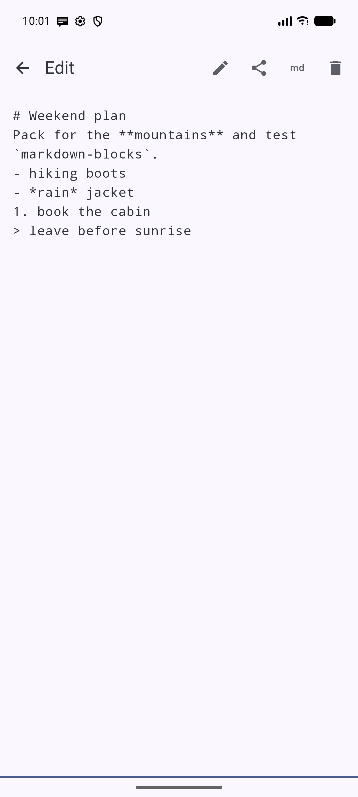
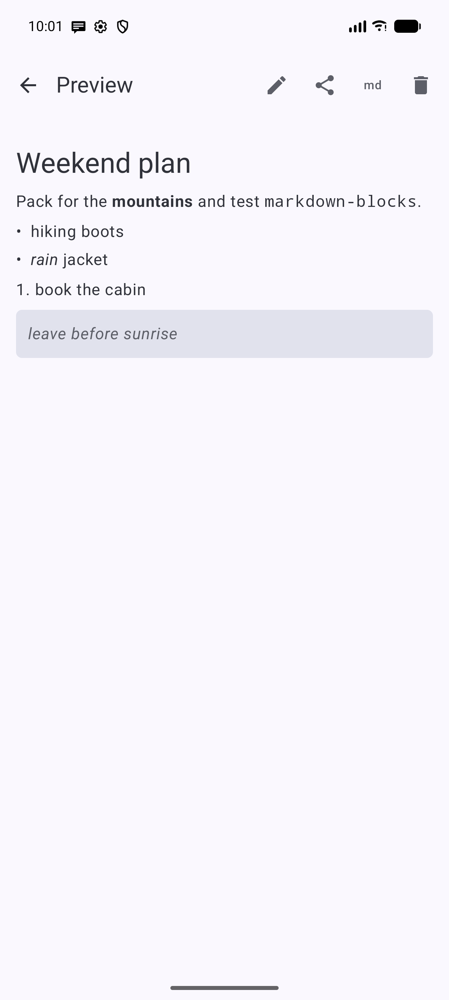
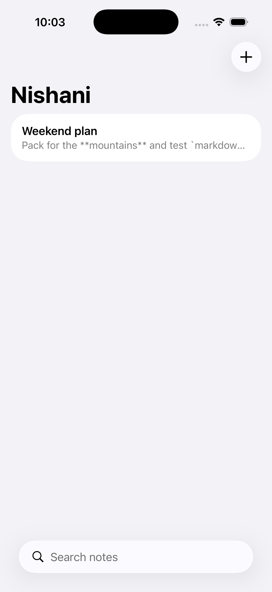

# Nishani 🖊️

**ნიშანი** (*nishani* — Georgian for "mark / sign") — a clean, offline-first
**markdown notes** app for **Android and iOS**, built with **Kotlin Multiplatform**.

Write notes in markdown, preview them rendered, search across everything, and share —
all stored locally on device. The parsing and data logic live once in shared Kotlin;
the UI is **native on each platform** (Jetpack Compose on Android, SwiftUI on iOS).

## Screenshots

| Android — editor | Android — rendered preview | iOS — native SwiftUI |
|:---:|:---:|:---:|
|  |  |  |

*The middle shot is the shared Kotlin parser's output rendered by Compose. On the right, the
same shared code — note titles and previews derived in Kotlin — driving a native SwiftUI list.*

## Architecture — Kotlin Multiplatform, native UI

Deliberately **no shared UI** — only shared logic, like a well-factored KMM app should be:

```
shared/     Kotlin Multiplatform (commonMain + commonTest, Android + iOS targets)
            · MarkdownParser: text → blocks/spans (the core, unit-tested)
            · Note model, NotesRepository (JSON over a KeyValueStore), search
            · KeyValueStore: expect interface; SharedPreferences (Android) / NSUserDefaults (iOS)
androidApp/ Native Jetpack Compose UI — list, editor, live markdown preview
iosApp/     Native SwiftUI UI — same, rendering the shared parser's output
```

The markdown parser produces a platform-neutral tree of `MdBlock`/`MdSpan`, and each
platform renders it natively (Compose `AnnotatedString`, SwiftUI `Text`).

## Features

- ✍️ **Markdown editor** with a live rendered **preview** toggle.
- 🔤 Supports headings, bullets, block quotes, fenced code, rules, and inline **bold** / *italic* / `code`.
- 🔎 **Search** across all notes (shared, case-insensitive).
- 💾 **Debounced autosave**, offline-first local storage.
- 📤 **Share** a note via the system share sheet.
- 🎨 Material 3 on Android (dynamic color, light/dark); native look on iOS.

## Tech

- Gradle 9.3.1 · AGP 9.1.1 · Kotlin 2.3.21 · Compose BOM 2026.06.01
- compileSdk 36 · minSdk 26 · iOS 16+
- kotlinx-serialization for note persistence

## Build & run

```bash
# Android
./gradlew :androidApp:assembleDebug
# Shared unit tests (the parser + search)
./gradlew :shared:testAndroidHostTest
# iOS: open iosApp in Xcode (XcodeGen: `cd iosApp && xcodegen`) and Run
```

## Status

✅ **v0.1.0** — markdown editor + live preview, search, autosave, share, and offline local
storage, working on **Android** and **iOS** (native UIs over one shared Kotlin core). See
[issues](../../issues) for what's next.

## License

[MIT](LICENSE)
